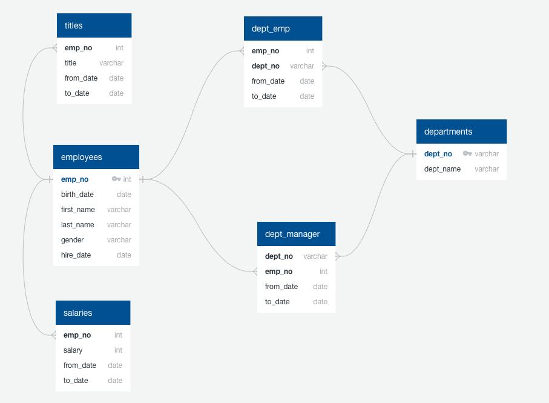

# Analysis Employee Database by using SQL 


## Background

As a data analyst to analysis employee database is nessary skill for your company. It's a research project on employees of the corporation from the 1980s and 1990s. All that remain of the database of employees from that period are six CSV files.

I design the tables to hold data in the CSVs, import the CSVs into a SQL database; I perfomed data modeling, data engineering and data analysis of data.

## File

* department_information.csv
* department_emp.csv
* department_manager.csv
* employees.csv
* salaries.csv
* titles.csv

## Steps

### 1. Data Modeling

* Inspect the CSVs and sketch out an ERD of the tables by using quick database diagrams web.



### 2. Data Engineering

* Create a table schema for each of the six CSV files.

* Import each CSV file into the corresponding SQL table.

  ```sql
   CREATE TABLE "departments" (
    "dept_no" varchar   NOT NULL,
    "dept_name" varchar   NOT NULL,
    CONSTRAINT "pk_departments" PRIMARY KEY ("dept_no"));
    
    CREATE TABLE "dept_emp" (
    "emp_no" int   NOT NULL,
    "dept_no" varchar   NOT NULL,
    "from_date" date   NOT NULL,
    "to_date" date   NOT NULL);
    
    CREATE TABLE "dept_manager" (
    "dept_no" varchar   NOT NULL,
    "emp_no" int   NOT NULL,
    "from_date" date   NOT NULL,
    "to_date" date   NOT NULL);
    
    CREATE TABLE "employees" (
    "emp_no" int   NOT NULL,
    "birth_date" date   NOT NULL,
    "first_name" varchar   NOT NULL,
    "last_name" varchar   NOT NULL,
    "gender" varchar   NOT NULL,
    "hire_date" date   NOT NULL,
    CONSTRAINT "pk_employees" PRIMARY KEY ("emp_no"));
    
    CREATE TABLE "salaries" (
    "emp_no" int   NOT NULL,
    "salary" int   NOT NULL,
    "from_date" date   NOT NULL,
    "to_date" date   NOT NULL);
    
    CREATE TABLE "titles" (
    "emp_no" int   NOT NULL,
    "title" varchar   NOT NULL,
    "from_date" date   NOT NULL,
    "to_date" date   NOT NULL);
    
    ALTER TABLE "dept_emp" ADD CONSTRAINT "fk_dept_emp_emp_no" FOREIGN KEY("emp_no")
    REFERENCES "employees" ("emp_no");
    
    ALTER TABLE "dept_emp" ADD CONSTRAINT "fk_dept_emp_dept_no" FOREIGN KEY("dept_no")
    REFERENCES "departments" ("dept_no");
    
    ALTER TABLE "dept_manager" ADD CONSTRAINT "fk_dept_manager_dept_no" FOREIGN KEY("dept_no")
    REFERENCES "departments" ("dept_no");
    
    ALTER TABLE "dept_manager" ADD CONSTRAINT "fk_dept_manager_emp_no" FOREIGN KEY("emp_no")
    REFERENCES "employees" ("emp_no");
    
    ALTER TABLE "salaries" ADD CONSTRAINT "fk_salaries_emp_no" FOREIGN KEY("emp_no")
    REFERENCES "employees" ("emp_no");
    
    ALTER TABLE "titles" ADD CONSTRAINT "fk_titles_emp_no" FOREIGN KEY("emp_no")
    REFERENCES "employees" ("emp_no");
   ```

### 3. Data Analysis including:

1. Each employee: employee number, last name, first name, gender, and salary.

 ```sql
   select employees.emp_no as "employee number",employees.last_name as "last name",
   employees.first_name as "first name",employees.gender, salaries.salary
   from employees
   left join  salaries on employees.emp_no=salaries.emp_no;
   ```

2. Employees who were hired in specific year.
```sql
   select employees.emp_no as "employee number",employees.last_name as "last name", 
   employees.first_name as "first name",employees.hire_date
   from employees
   where date_part('year', hire_date)  =1986;
  ```
  
3. Manager of each department with the following information: department number, department name, the manager's employee number, last name, first name, and start and end employment dates.

```sql
  select 
  b.first_name as "manager_first_name", b.last_name as "manager_last_name", 
  a.department_number,a.department_name,
  a.employee_number,a.first_name as "employee_first_name",a.last_name as "employee_last_name",
  a.start_date as "employee_start_date", a.end_date as "employee_end_date"
  from 
  (select dept_manager.emp_no as "manager_no", dept_manager.dept_no as "department_number",
  dept_manager.from_date  as "manager_start_date",dept_manager.to_date  as "manager_end_date",
  departments.dept_name as "department_name", 
  dept_emp.emp_no as "employee_number",
  employees.first_name as "first_name", employees.last_name as "last_name",
  dept_emp.from_date as "start_date", dept_emp.to_date as "end_date"
  from dept_manager 
  left join departments on dept_manager.dept_no=departments.dept_no
  left join dept_emp on departments.dept_no=dept_emp.dept_no
  left join employees on employees.emp_no=dept_emp.emp_no
  where dept_manager.to_date >=dept_emp.to_date) as a
  left join employees as b on b.emp_no =a.manager_no; 
  ```
  
4. Department of employees with the following information: employee number, last name, first name, and department name.

```sql
  select 
  dept_emp.emp_no as "employee_number",
  employees.first_name as "employee_first_name", employees.last_name as "employee_last_name",
  dept_emp.from_date as "employee_start_date", dept_emp.to_date as "employee_end_date",
  departments.dept_name as "department_name" 
  from dept_emp
  left join departments on departments.dept_no=dept_emp.dept_no
  left join employees on employees.emp_no=dept_emp.emp_no;
  ```

5. All employees whose first name is "Hercules" and last names begin with "B."

```sql
  select * from employees
  where first_name='Hercules' and 
  last_name like 'B%';
```

6. All employees in the Sales and Development departments, including their employee number, last name, first name, and department name.

```sql
  select 
  dept_emp.emp_no as "employee_number",
  employees.first_name as "employee_first_name", employees.last_name as "employee_last_name",
  departments.dept_name as "department_name" 
  from dept_emp
  left join departments on departments.dept_no=dept_emp.dept_no
  left join employees on employees.emp_no=dept_emp.emp_no
  where departments.dept_name='Sales' or departments.dept_name='Development';
  ```

8. In descending order, list the frequency count of employee last names, i.e., how many employees share each last name.

```sql
  select a.last_name, count(last_name) as "count of last name" 
  from employees as a 
  group by last_name
  order by count(last_name) desc;
  ```

### 4. Data Vasulization by Python

1. Import the SQL database into Pandas. 

2. Create a histogram to visualize the most common salary ranges for employees.

3. Create a bar chart of average salary by title.

## Challenges
Create a table schema for each of the six CSV files. Remember to specify data types, primary keys, foreign keys, and other constraints.

## Conclusions
